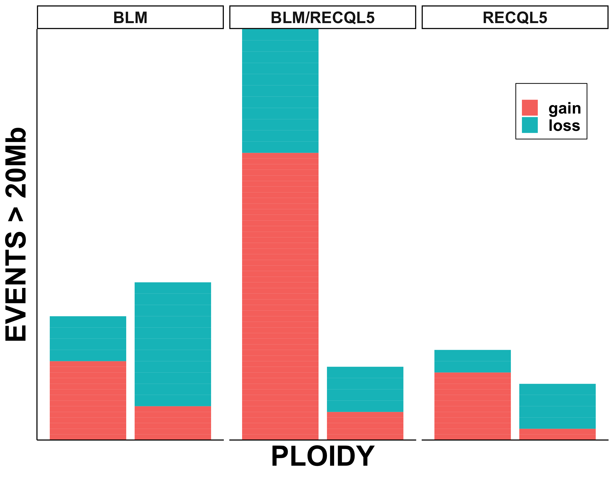
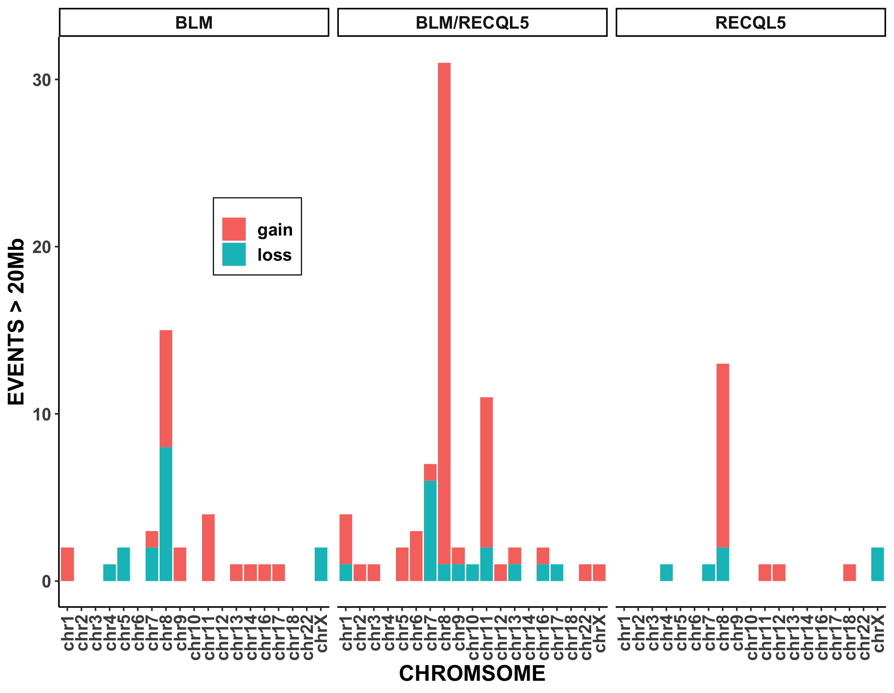
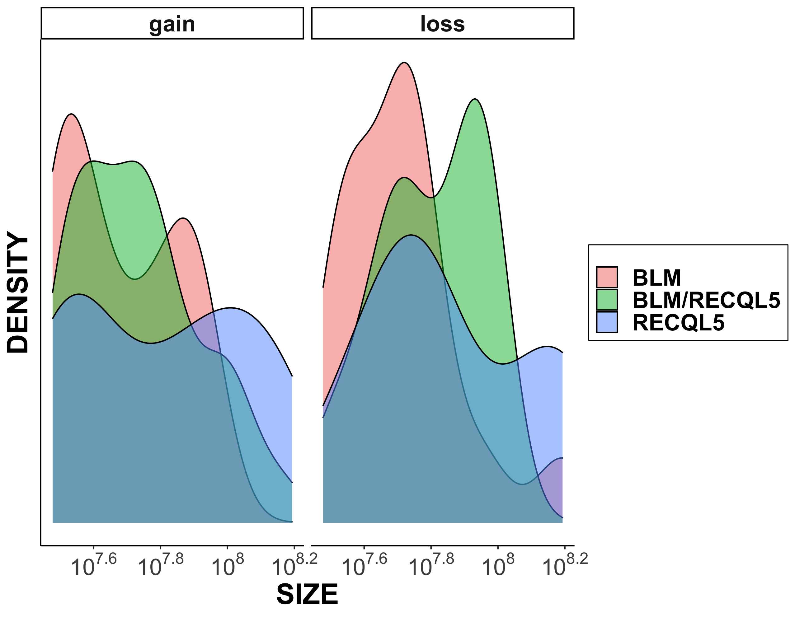
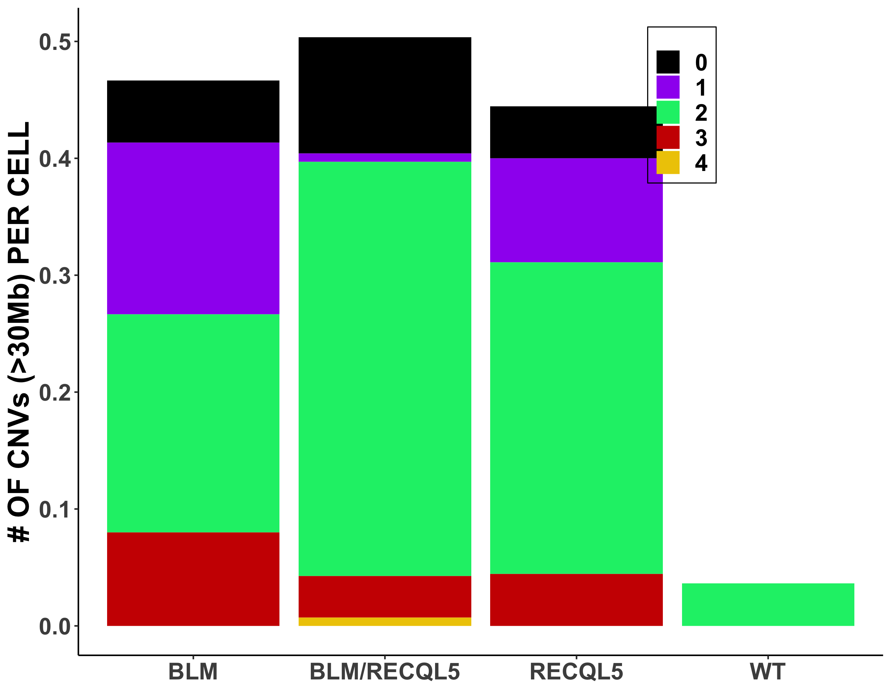

## Copy variant analysis in Strand-seq data using AneuFinder

#### Structure
1. Collect all CNV segments using AneuFinder
2. For each cell
	a. Remove all segments < 500Kb
	b. Assign ploidy state based off most recurring ploidy state
	c. Remove all segments < 20Mb (user cutoff) and in given ploidy state
	d. Classify each segment as either gain or loss relative to cell ploidy state
	e. Summarize CNV profile
3. Save summary file with each library's CNV profile and perform some preliminary plotting

#### Example output of some plots

